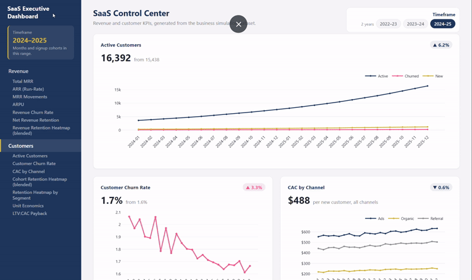

# Business Scenario
**Simulations:** 

Imagine this business scenario.  I am a Data Analyst at a SaaS startup.  My responsibility is to analyze customer economics, cohort performance, and unit economics across that company's acquisition channels and across plan tiers. 

My deliverables are:
- the [Analyst's Report](#analysts-report), which discusses VC funding readiness based on available data, and
- the SaaS Dashboards
	- [2022-2023](https://sandygcabanes.github.io/SaaS-Cohort-Unit-Economics-DBT-to-Dashboards/saas_dashboard_2022-2023.html#revenue)
	- [2023-2024](https://sandygcabanes.github.io/SaaS-Cohort-Unit-Economics-DBT-to-Dashboards/saas_dashboard_2023-2024.html#revenue)
	- [2024-2025](https://sandygcabanes.github.io/SaaS-Cohort-Unit-Economics-DBT-to-Dashboards/saas_dashboard_2024-2025.html#revenue)
	 

In this repo, the operating data are simulated.  Since SaaS data are usually confidential, this is a deliberate **proxy for a real-world scenario.**

In short, this project is a full end-to-end system, with **two-simulation paths:**

- **Downstream:** data generation (ground truth) -> validation -> visualization. The pattern, builds and constants for the data-generating process are explicitly defined to represent the behavior of a SaaS business with three channels and three plan tiers.
- **Upstream:**  data generation (ground truth) -> disaggregation -> [dbt from raw csv](https://github.com/SandyGCabanes/SaaS-Cohort-Unit-Economics-Dashboards/tree/main/dbt_from_raw_csv) -> dbt to export deconstruction. The resulting **ground truth** customer and cost data are further disaggregated into simulated third-party source-system extracts to simulate data that requires processing through the dbt pipeline.

Please see the [overall_project_diagram.txt](https://github.com/SandyGCabanes/SaaS-Cohort-Unit-Economics-DBT-to-Dashboards/blob/main/overall_project_diagram.txt) for this project.  

# Analyst's Report 

## VC Funding Readiness . KPI Summary

**Prepared for:** The SaaS founders

**Prepared by:** Data Analyst Sandy G. Cabanes

**Date:** October 2, 2026

**Data source:** Business simulation [dataset-demo](https://github.com/SandyGCabanes/SaaS-Cohort-Unit-Economics-DBT-to-Dashboards/blob/main/source/dataset_generation/saas_dataset_v9_demo_2022-01_2024-12_20261006_102453.csv)

**Based on:** [2024-2025](https://sandygcabanes.github.io/SaaS-Cohort-Unit-Economics-DBT-to-Dashboards/saas_dashboard_2024-2025.html#revenue) 

 

## Executive Summary of KPIs

| KPI | Dec 2024 | Dec 2025 | What this means |
|---|---|---|---|
| Logo growth | +6.5% MoM | +6.2% MoM | Positive but slowing |
| Revenue growth | +7.9% MoM | +6.7% MoM | Slowing |
| LTV:CAC (24-month blended) | 6.7x | 6.9x | Healthy and growing |
| NRR | 101.2% | 100.5% | About 9.5 points below the 110% Series A bar |
| Churn (logo) | 1.8% | 1.7% | Good and steady |
| Payback | Month 3 to 4 | Month 3 to 4 | Very fast |

This looks like a fundable business. Churn is low, payback is very fast, and every plan and channel more than meets the usual 3x LTV:CAC benchmark. Customer retention curves are steady from one cohort to the next.

Two things might make the pitch weaker

- **Growth is slowing.** Monthly revenue growth fell from 7.9% to 6.7% even though monthly signups roughly doubled. The revenue base is growing faster than new sign-ups can lift it.
- **NRR is only a little above 100%.** It slipped from 101.2% to 100.5%. **MRR Movements**: Revenue growth leans on new business, and investors would like to see more growth coming from expansion of existing accounts.

## 1. Growth & Scale

| Metric | Dec 2024 | Dec 2025 |
|---|---|---|
| Total MRR | $1,121,558 (from $1,039,478, +7.9%) | $2,638,614 (from $2,474,087, +6.7%) |
| ARR (run-rate) | $13,458,699 | $31,663,365 |
| ARPU | $147 (+1.3%) | $161 (+0.4%) |
| Active customers | 7,625 (+6.5%) | 16,392 (+6.2%) |

At $161 monthly ARPU (about $1,930 a year per account) this will be considered an SMB-focused product. This is under the $25K annual contract value line that separates SMB from mid-market SaaS. 

| Period | MoM MRR growth |
|---|---|
| 2023-06 | 9.3% |
| 2023-12 | 9.1% |
| 2024-06 | 7.9% |
| 2024-12 | 7.9% |
| 2025-06 | 7.7% |
| 2025-12 | 6.7% |

Year over year, MRR grew 155.1% from Dec 2023 to Dec 2024, and 135.3% from Dec 2024 to Dec 2025. These are plain December-to-December changes in MRR. This slowdown is expected, as each year's base is larger than previous year's base.

| MRR movement, % of prior-month MRR | Dec 2023 | Dec 2024 | Dec 2025 |
|---|---|---|---|
| New business | 8.5% | 6.7% | 6.1% |
| Expansion | 3.5% | 3.8% | 3.5% |
| Contraction | -1.7% | -1.7% | -1.8% |
| Churn | -1.2% | -0.9% | -1.1% |
| Net MRR growth | 9.1% | 7.9% | 6.7% |

> New business explains almost all of the slowdown. It fell from 8.5% to 6.1% of prior-month MRR, while expansion stayed flat near 3.5%. Contraction rose a little in 2025 (1.7% to 1.8%) and is worth watching. Expansion minus contraction and churn leaves only about 0.5 points, which is why NRR sits near 100%.

## 2. Retention

| Metric | Dec 2024 | Dec 2025 |
|---|---|---|
| Net Revenue Retention (NRR) | 101.2% | 100.5% |
| Revenue churn rate | 0.9% (from 1.3%) | 1.1% (from 0.9%) |
| Customer (logo) churn rate | 1.8% (from 1.9%) | 1.7% (from 1.6%) |

**NRR: Needs improvement.** At 100.5%, existing customers add a small amount of revenue on net. Series A investors look for NRR above 110%, so this sits about 9.5 points short. This is driven by Basic plan-tier and Ads, as seen below.

| NRR by segment | Dec 2024 | Dec 2025 |
|---|---|---|
| Basic | 98.4% | 98.5% |
| Pro | 99.6% | 100.0% |
| Enterprise | 101.8% | 100.8% |
| Ads | 99.9% | 99.6% |
| Organic | 101.6% | 100.7% |
| Referral | 102.5% | 101.5% |

The blended 100.5% figure mentioned earlier is driven by Enterprise plan and Referral channel.  Enterprise is the only plan clearly above 100% in both years. On the channel side, Ads is below 100% in both years.

**What the business can do:**  
- **Basic users:** Offering smaller feature add-ons instead of forcing a full plan jump may be able to capture more revenue safely from Basic users. 
- **Pro users:** Similarly, offering modular add-ons instead of forcing a massive price jump towards Enterprise may ease customers into higher spending.
- **Set up alerts** when usage drops to help support teams that step in before the customer downgrades.  
- Consider setting up **automated onboarding emails** to help catch accounts before they shrink their usage. 
- Referral retention is higher than Organic.  **Spend more on referral incentives** to bring in accounts that stick around and spend more over time. Test out **shifting Ads spending to Referral incentives.**
- **Encourage feature adoption** early on. Accounts that use core product features within their first month are less likely to downgrade. 

## 3. Churn 
**Churn: Good.** Logo churn of 1.7% and revenue churn of 1.1% in Dec 2025 are both better than the 2% to 4% monthly range typical for SMB SaaS. Logo churn slowly decreased, while Revenue churn increased.

In the cohort data, about 91% to 93% of customers are still active one month after signup. The retention curve is steady across cohorts. This is a real strength to show investors.

| Cohort | Month 1 | Month 12 | Month 24 |
|---|---|---|---|
| Jan 2023 | 91.4% | 77.2% | 70.4% |
| Jan 2024 | 92.8% | 78.3% | n/a|
| Jan 2025 | 91.9% | n/a | n/a |

## 4. Unit Economics & Efficiency

| Metric | 2024 cohorts | 2025 cohorts |
|---|---|---|
| CAC per new customer (total spend / total new customers) | $443 | $476 |
| CAC per new customer, December cohort | $450 | $488 |
| LTV:CAC ratio (24-month) | 6.80x | 6.89x |
| Cohorts that have paid back CAC | 12 of 12 | 12 of 12 |

**How the numbers are built.** Only cohorts with a full 24 months of history count towards LTV, and each customer counts once. CAC is total acquisition spend divided by total new customers. 

CAC per new customer rose from $432 (Dec 2023 cohort) to $450 (Dec 2024) to $488 (Dec 2025). 

| Segment | LTV:CAC 2024 |  LTV:CAC 2025 |
|---|---|---|
| Ads / Basic | 3.28x | 3.25x |
| Ads / Pro | 3.84x | 3.84x
| Ads / Enterprise | 4.84x | 4.85x |
| Organic / Basic | 9.94x | 9.99x |
| Organic / Pro | 11.74x | 11.75x |
| Organic / Enterprise | 14.72x | 14.79x |
| Referral / Basic | 5.55x | 5.58x |
| Referral / Pro | 6.74x |  6.76x |
| Referral / Enterprise | 8.40x | 8.38x|

**What the business needs to do:** 
- The business needs to evaluate CAC of Ads and find ways to make Ads spending more efficient.
- Learn from what drives Organic acquisition and build on it.  

**Payback: Fast.** Every cohort has recovered its acquisition cost. Healthy is generally considered 12 months or less, with an industry median near 18 months. This needs to be maintained.

## 5. Next Steps Before the Pitch

This analysis was built from product and billing data: MRR, CAC, customer counts. The following are a few things investors will ask for. These are **beyond the scope of this dataset,** e.g., in the finance/accounting system.  
These can be evaluated separately by a **Financial Analyst.**

- **Gross margin.** Series A investors expect gross margin above 70%. We will need hosting, support, and COGS figures layered on top of the revenue numbers.
- **Rule of 40.** Growth rate plus profit margin, with 40%+ considered healthy. The growth half is available: MRR grew 135.3% from Dec 2024 to Dec 2025. The margin half needs the finance data above. 
- **Burn multiple and magic number.** How efficiently cash and sales spend convert into new ARR. Needs P&L and cash data.

## Sources of Saas Benchmarks
- [SaaS Capital](https://www.saas-capital.com/blog-posts/benchmarking-metrics-for-bootstrapped-saas-companies/), *2026 Benchmarking Metrics for Bootstrapped SaaS Companies*
- [Optifai](https://optif.ai/learn/questions/b2b-saas-net-revenue-retention-benchmark/), *B2B SaaS NRR Benchmarks* (2026, N=939), cross-referenced with ChartMogul's *Subscription Growth Benchmark*
- [Averi.ai](https://www.averi.ai/how-to/the-saas-benchmarks-report-2026-how-your-startup-stacks-up-(from-pre-seed-to-series-a)), *The SaaS Benchmarks Report 2026: Pre-Seed to Series A*
- [Livmo](https://livmo.com/blog/saas-churn-benchmarks-valuation/), *SaaS Churn Benchmarks 2026*
- [SaaSHero](https://www.saashero.net/strategy/b2b-saas-ltv-cac-benchmarks/), *Best LTV to CAC Ratio Benchmarks for B2B SaaS in 2026*
- [DigitalApplied](https://www.digitalapplied.com/blog/saas-unit-economics-2026-cac-ltv-payback-reference), *SaaS Unit Economics 2026: CAC, LTV & Payback Reference* (citing Benchmarkit 2025 data)
- [Angel Investors Network](https://angelinvestorsnetwork.com/venture-capital/series-a-funding-requirements-2026), *Series A Funding Requirements 2026*
- [Aleph × Benchmarkit](https://www.getaleph.com/answers/rule-of-40-saas-2026), *2026 SaaS & AI Performance Benchmarks* (Rule of 40)
- [SaaS Metrics Calculator](https://saasmetricscalculator.com/saas-benchmarks-by-arr-tier), *SaaS Benchmarks by ARR Tier 2026*
			 

> **A note on the data.** This dashboard runs on a business simulation dataset built for demonstration purposes, to represent real transactions. This summary shows how a Data Analyst would evaluate VC funding readiness using this KPI set. The conclusion is a simulated recommendation before pitching to investors. 

> ### Limitations of the disaggregation code simulation

> - Stripe customers carry a `source_customer_id` that links to the marketing files. Real 3rd-party exports have to be joined by date only. An advanced production pipeline would match customers on email, click IDs, or UTM data.
> - Every customer has a channel. Real data has an "Unknown" or "Direct" bucket.
> - CAC by plan tier is an allocation. Ad spend happens before a customer picks a plan.
> - Disaggregated data are smoother than real data. Channel splits are assumed.

