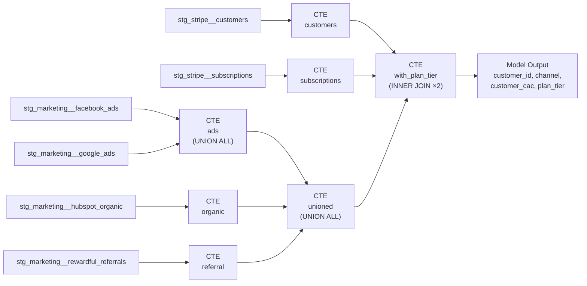

## Column-level lineage

| Output Column | Source Table(s) | Source Column | Transformation |
|---|---|---|---|
| `customer_id` | `stg_marketing__facebook_ads`, `stg_marketing__google_ads`, `stg_marketing__hubspot_organic`, `stg_marketing__rewardful_referrals` | `customer_id` | Direct (pass-through via UNION ALL) |
| `channel` | same 4 marketing tables | `channel` | Direct |
| `customer_cac` | same 4 marketing tables | `acquisition_cost_usd` | Renamed (alias) |
| `plan_tier` | `stg_stripe__subscriptions` | `plan_tier` | Direct (via join through `stg_stripe__customers.stripe_customer_id`) |

## Join key lineage (filter/indirect)

| Join | Key Columns | Role |
|---|---|---|
| `unioned` ⋈ `customers` | `customer_id` | INNER JOIN — rows without a matching Stripe customer are dropped |
| `customers` ⋈ `subscriptions` | `customers.stripe_customer_id` = `subscriptions.stripe_customer_id` | INNER JOIN — rows without an active subscription are dropped |

The two `stripe_customer_id` columns act as **filter lineage**: they don't appear in the output but determine which rows survive.
